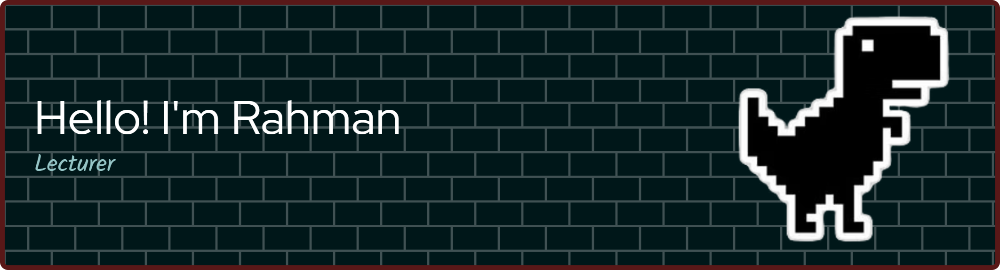

- 👋 Hi, I’m Rahman
- 🌱 I’m currently learning [**Python**](https://Pyhthon.org)

- 🔭 I’m currently working on 

##### Skils

##### Connect with me  

##### Play games with me

###

<!---
crangka/crangka is a ✨ special ✨ repository because its `README.md` (this file) appears on your GitHub profile.
You can click the Preview link to take a look at your changes.
# 💫 About Me:
🔭 I’m currently working on ... 👯 I’m looking to collaborate on  🤝 I’m looking for help with 🌱 I’m currently learning Python 💬 Ask me about ⚡ 

--->
